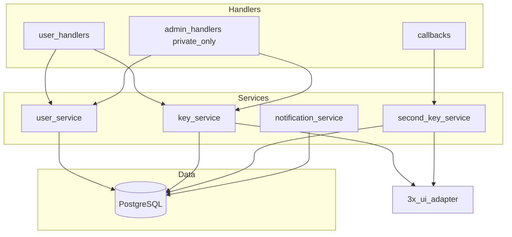

# VPN Telegram Bot + 3x-ui — финальное проектирование (refined)

## Принципы (правки от заказчика)

- Минимум лишней сложности: UoW — простой контекстный менеджер сессии + commit/rollback, без паттернов ради паттернов.
- Rate limiting: **MVP** — in-process (например `cachetools.TTLCache` или простой dict + время окна) **или** очень тонкая таблица в PG только если без неё совсем нельзя; приоритет — короткий код.
- Уведомления пользователю до `/start`: одна таблица **`pending_user_notifications`** (user telegram id, text/payload type, created_at, sent_at), без event bus.
- Legacy: только ручные шаги админа — создать user по `telegram_user_id`, импорт клиентов из панели, bind к user; **bind по умолчанию только UPDATE в БД**, **без** вызовов 3x-ui; опциональный sync remark в панели — **отдельный env-флаг, по умолчанию выключен**.
- Админка: удобные сценарии под реальный workflow (создать legacy user, импорт, bind, просмотр ключей, revoke одного ключа) — **slash + inline menu** где уместно.
- 3x-ui: **Protocol** + адаптер с явными «ASSUMPTION» комментариями; в README — список мест для подгонки под версию; команда **`/admin_panel_check`** (или `/admin_health`) — логин + список inbounds до боевой логики (можно вызывать вручную).
- Секреты: в БД **не** хранить полный subscription URL / полный конфиг; хранить идентификаторы панели; link/config — **on demand** через API; логи — маскирование query params, токенов, длинных base64.
- **Ключ** = один client record в 3x-ui; макс **2 активных** на пользователя; слот 1 и 2; третий запрещён — инварианты в сервисе + **partial unique index** в PG на `(telegram_user_id, key_slot_number)` WHERE `status = 'active'`.
- Статусы **`vpn_keys`**: только **`active` / `revoked` / `imported_unbound`**. Состояния заявки на второй ключ — в **`second_key_requests`** (pending/approved/rejected и т.д.).
- README: прагматичный сценарий — **тот же Ubuntu-сервер**, **long polling**, **без webhook**, **без nginx** если не нужен, **не публиковать лишние порты** (только Postgres внутри docker network при compose).
- **Admin-only privacy**: все админ-хендлеры и выдача PII — только **private chat** и **from_user.id == ADMIN_TELEGRAM_ID**; в группах админ-команды **игнорировать**.

---

## Архитектура (финальная)

```
Handlers (user / admin / callbacks)
        → Services (тонкая оркестрация, инварианты, rate limit MVP)
        → Repositories (SQLAlchemy async)
        → PostgreSQL
Services → VpnPanelClient (Protocol) → ThreeXUiAdapter (httpx, мало предположений)
```

- **Транзакции**: критичные операции (выдача слота, регенерация, approve второго ключа) в одной транзакции с `SELECT ... FOR UPDATE` по строке `users` (или по `users` по pk после lock).
- **Идемпотентность**: уникальные индексы + обработка `IntegrityError` → дружелюбный ответ пользователю / «уже обработано» админу.



---

## Интеграция 3x-ui

- Интерфейс `VpnPanelClient` (Protocol) с методами, нужными продукту: `login`, `list_inbounds`, `create_client`, `get_client_link` (on demand), `disable_or_revoke_client`, `list_clients_for_inbound` (импорт), и т.д.
- Реализация `ThreeXUiAdapter`: минимальный набор HTTP-вызовов; каждый блок с комментарием `ASSUMPTION: path/field for 3x-ui vX`.
- **Health**: отдельный метод `healthcheck()` = login + `list_inbounds`; вызывается из `/admin_panel_check`.
- Retry: только на сеть/5xx; без логирования тел ответов с секретами.

---

## Legacy flow (упрощённый)

1. Админ (private): создать пользователя по `telegram_user_id` → запись `users`.
2. Админ: импорт клиентов из панели → строки `vpn_keys` со статусом `imported_unbound`, `telegram_user_id` NULL, идентификаторы панели заполнены.
3. Админ: bind — выбрать unbound key + указать `telegram_user_id` → **только БД**: выставить `telegram_user_id`, слот (1 или 2), `status=active`, `source=imported`.
4. Пользователь `/start` → видит ключи; панель не менялась.
5. Опционально `PANEL_UPDATE_REMARK_ON_BIND=false` (default): если true — отдельный вызов адаптера (явно документированный риск).

---

## Сущности БД

- **users** — как в ТЗ; unique `telegram_user_id`.
- **vpn_keys** — идентификаторы панели (inbound_id, client id/email/uuid/subId по факту доступного API), `key_slot_number` 1|2, `source` imported|issued_by_bot, `status` active|revoked|imported_unbound, `telegram_user_id` nullable до bind, timestamps, `revoked_at`.
- **second_key_requests** — pending/approved/rejected, решение админа, timestamps.
- **regeneration_history** — old_key_id, new_key_id, initiator, timestamp.
- **import_bindings** — узкая таблица факта привязки (без дублирования бизнес-логики): `vpn_key_id`, `telegram_user_id`, `admin_telegram_id`, `created_at`; дублирующее событие также пишется в `audit_log` для единообразного `/admin_logs`.
- **admin_actions** — тип действия, actor admin id, refs, metadata без секретов.
- **audit_log** — все важные события (включая rate limit, ошибки панели).
- **pending_user_notifications** — очередь текста для пользователя до первого `/start`.

**Индекс:** partial unique на активные ключи пользователя по слоту (см. выше).

---

## Админ UX

- Private-only middleware/filter для всего admin router.
- Сценарии: inline-списки для «unbound keys», «bind to user», «revoke key»; slash-команды из ТЗ сохранить как быстрый путь.
- `/admin_panel_check` — health панели.

---

## Риски (сжато)

- Дрейф API 3x-ui — чинится только адаптером + README.
- Два inbound или один — конфиг `DEFAULT_INBOUND_ID`, опционально второй inbound для слота 2.
- Конкурентные клики — БД constraints + транзакции.

---

## Реализация (после подтверждения)

Сгенерировать полный код проекта в `app/`, Docker, Alembic, README по этому документу.
